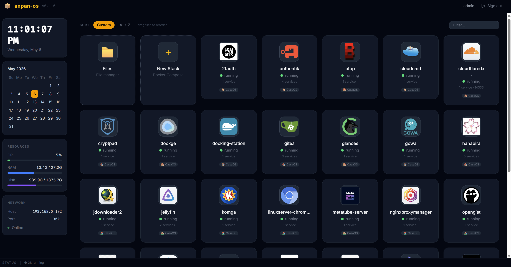
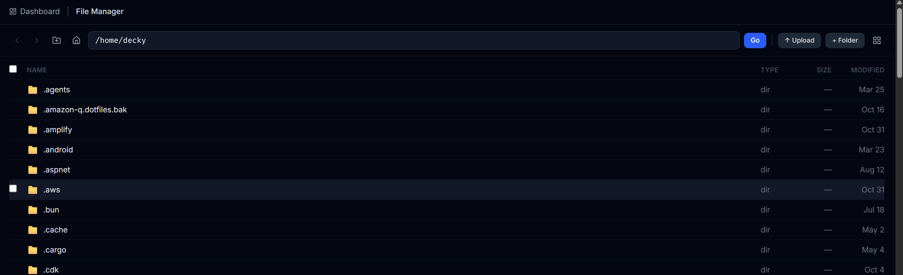
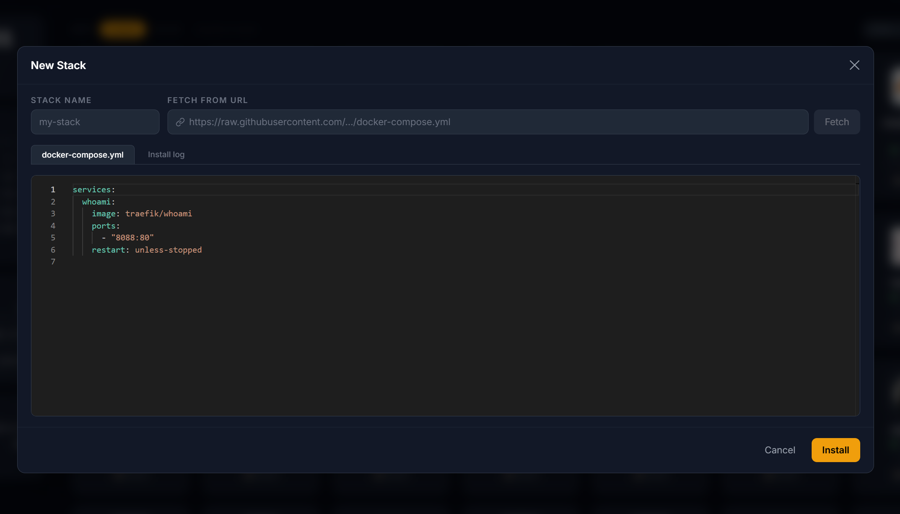
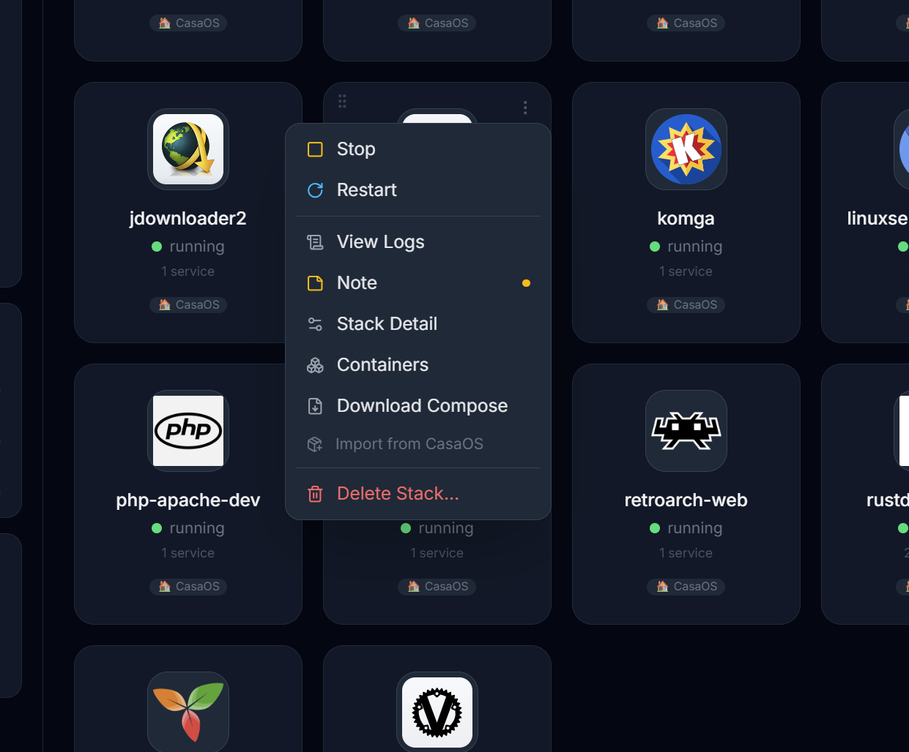

# anpan-os

A lightweight self-hosted home server dashboard built with **Bun**, **ElysiaJS**, and **React**.

Manage Docker Compose stacks, browse files, monitor system resources, and install apps from community stores — all from a single web UI with no external dependencies beyond Docker and Bun.

---

## Screenshots

| Dashboard | File Manager |
|-----------|-------------|
|  |  |

| New Stack | Stack Actions |
|-----------|--------------|
|  |  |

---

## Features

### Docker & Stacks
- **Compose dashboard** — install, start, stop, restart, and delete stacks
- **Guided Compose Editor** — Monaco-based YAML editor with syntax highlighting, starter templates, and in-place editing
- **Live install logs** — real-time streaming of `docker compose up` output
- **Live container logs** — per-tab streaming log viewer for running containers
- **Pull & update** — one-click image pull and stack redeploy
- **Compose source doctor** — reports which compose file each container was actually created from, flagging stacks left anchored to a foreign or deleted path
- **Compose repair** — re-anchors a drifted stack onto the managed compose folder, refusing when doing so would delete a running service the compose file does not define

### App Store
- **Browse remote apps** — search and install apps from any CasaOS-compatible GitHub repository
- **Repo manager** — add, enable/disable, and refresh multiple app sources
- **External bookmarks** — pin arbitrary web app links on the dashboard alongside managed stacks

### File Manager
- Browse, upload, download, rename, and delete files on the host
- Copy / cut / paste across directories
- File info panel with metadata and recursive folder size
- Guided `chmod` / `chown` UI with human-readable permission display

### System & Security
- **System monitor** — CPU, memory, disk, and network stats in the sidebar
- **Port scanner** — scan host ports to identify listening services
- **Samba management** — add, edit, and remove Samba shares; SQLite-backed source of truth
- **WebAuthn passkeys** — register and authenticate with platform authenticators
- **Auth** — JWT session login; bcrypt password storage; in-app password change
- **HTTPS** — optional TLS via cert/key paths in config
- **Doctor dialog** — dependency checker for required system binaries

### Developer
- **Type-safe API** — Eden Treaty client with full end-to-end type inference
- **CasaOS compatible** — reads `x-casaos` metadata from existing app definitions

---

## Requirements

- [Bun](https://bun.sh) ≥ 1.1
- Docker with the Compose plugin (`docker compose`)
- **Must run as root (`sudo`)** — required for Docker management, full filesystem access, and CasaOS migration
- Linux (systemd) or macOS 11+ (launchd), on x86-64 or arm64 — including Apple Silicon

---

## Platform support

anpan-os runs as a root service on Linux and macOS. Most features are identical; the
differences below are the ones where the two systems genuinely diverge.

| Feature | Linux | macOS |
| --- | --- | --- |
| Docker / Compose stacks | ✅ Docker Engine | ✅ Docker Desktop, OrbStack, Colima or Rancher Desktop — the socket is discovered, not assumed |
| File manager, ports, system stats | ✅ | ✅ |
| Reboot / shutdown | ✅ `systemctl` | ✅ `shutdown` |
| Self-update | ✅ | ✅ |
| Samba shares | ✅ | ⚠️ Requires `brew install samba` — see below |
| CasaOS migration | ✅ | ❌ Hidden — CasaOS does not run on macOS |

**About Samba on macOS.** macOS ships `/usr/sbin/smbd`, but it is Apple's own SMB server,
not Samba: it does not read `smb.conf`, and its shares are defined in System Settings →
General → Sharing. anpan-os manages shares by writing a config file and including it from
`smb.conf`, which only works with real Samba. Rather than accepting shares that would
silently never appear, anpan-os detects which server is present and says so. Install Samba
with `brew install samba` to manage shares from anpan-os, or use System Settings to manage
them natively.

**Docker socket discovery.** The daemon runs as root, while every macOS Docker runtime puts
its socket in a user's home directory. anpan-os finds it — root can connect to a socket it
does not own — and points the `docker` CLI at the same one via `DOCKER_HOST`, so no Docker
Desktop setting needs changing.

---

## Install

> ⚠️ **anpan-os must run as root.**
> Without root, Docker socket access, the file manager, and CasaOS migration are either limited or unavailable.

### One-liner (Linux and macOS)

Downloads the release binary for your OS and architecture, verifies the SHA256 checksum, creates a default config, installs a service, and starts it — all in one step:

```bash
curl -fsSL https://raw.githubusercontent.com/deckyfx/anpan-os/main/install.sh | sudo bash
```

The script detects the platform and installs the matching service:

| | Linux | macOS |
| --- | --- | --- |
| Service | systemd unit at `/etc/systemd/system/anpan-os.service` | LaunchDaemon at `/Library/LaunchDaemons/io.anpan.anpan-os.plist` |
| Config | `/var/lib/anpan-os/config.toml` | `/usr/local/var/anpan-os/config.toml` |
| Binary | `/usr/local/bin/anpan-os` | `/usr/local/bin/anpan-os` |
| Logs | `journalctl -u anpan-os -f` | `tail -f /usr/local/var/anpan-os/anpan-os.log` |

If you prefer not to pipe to `sudo bash`, see [Manual download](#manual-download) below.

**The same command updates an existing install**, and re-running it is cheap: the checksum is fetched before the binary, so a host that is already current downloads nothing and the service is never restarted.

Options go after `bash -s --`:

```bash
# See what's available (no root needed)
curl -fsSL .../install.sh | bash -s -- --list

# Install or roll back to a specific release
curl -fsSL .../install.sh | sudo bash -s -- --release v0.7.0

# Never prompt (CI, automation)
curl -fsSL .../install.sh | sudo bash -s -- --yes
```

| Option | Effect |
| --- | --- |
| `-l, --list` | List available releases and exit. Does not require root. |
| `-r, --release TAG` | Install a specific release instead of the latest. Going backwards is treated as a rollback: it warns and asks for explicit confirmation. |
| `-y, --yes` | Never prompt. Implied automatically when no terminal is available. |
| `-f, --force` | Reinstall even when the installed binary is already identical. |

> ⚠️ **On rollback:** the config file and database are not downgraded, so an older binary may not understand state a newer one wrote.

After the script completes:

```bash
# Linux
systemctl status anpan-os
journalctl -u anpan-os -f

# macOS
sudo launchctl print system/io.anpan.anpan-os
tail -f /usr/local/var/anpan-os/anpan-os.log
```

Open `http://<your-server-ip>:5000` and complete the setup wizard on first run.

### Manual download

```bash
# Detect OS and architecture.
# macOS reports "arm64" where Linux reports "aarch64" — both mean the same binary.
case "$(uname -s)" in Linux) OS=linux ;; Darwin) OS=darwin ;; esac
case "$(uname -m)" in x86_64|amd64) ARCH=x64 ;; aarch64|arm64) ARCH=arm64 ;; esac

# Download binary + checksum
BASE="https://github.com/deckyfx/anpan-os/releases/latest/download"
curl -fsSL "${BASE}/anpan-os-${OS}-${ARCH}"        -o anpan-os
curl -fsSL "${BASE}/anpan-os-${OS}-${ARCH}.sha256" -o anpan-os.sha256

# Verify — macOS has no sha256sum
if [ "$OS" = darwin ]; then shasum -a 256 -c anpan-os.sha256; else sha256sum -c anpan-os.sha256; fi

# Install
chmod +x anpan-os
sudo mv anpan-os /usr/local/bin/anpan-os

# macOS only: strip the Gatekeeper quarantine flag curl set, or the binary
# is killed on launch with no useful message.
[ "$OS" = darwin ] && sudo xattr -d com.apple.quarantine /usr/local/bin/anpan-os 2>/dev/null

# Run
sudo anpan-os
```

### Systemd service (manual setup)

```bash
sudo tee /etc/systemd/system/anpan-os.service > /dev/null <<'EOF'
[Unit]
Description=anpan-os Home Server OS
After=network-online.target docker.service
Wants=network-online.target
Requires=docker.service

[Service]
Type=simple
WorkingDirectory=/var/lib/anpan-os
ExecStart=/usr/local/bin/anpan-os
Restart=on-failure
RestartSec=5

[Install]
WantedBy=multi-user.target
EOF

sudo systemctl daemon-reload
sudo systemctl enable --now anpan-os
```

---

## Getting Started (development)

```bash
# Clone
git clone git@github.com:deckyfx/anpan-os.git
cd anpan-os

# Install dependencies
bun install

# Run database migrations
sudo bun run migrate

# Start (development, with hot reload)
sudo bun run dev
```

Open `http://localhost:3000` and complete the setup wizard on first run.

> Running as root ensures all features work in development the same way they do in production.

---

## CLI

Running `anpan-os` with no arguments starts the server. These flags run a single task and exit:

| Flag | Purpose |
| --- | --- |
| `--doctor` | Check required system binaries and report what is missing |
| `--compose-doctor [--all]` | Report which compose file each stack's containers were created from. Exits non-zero when any stack needs repair, so it can gate a deploy script. `--all` lists healthy stacks too |
| `--compose-repair <stack…>`<br>`--compose-repair --all` | Re-anchor stacks onto the managed compose folder. Containers are recreated; named volumes and networks are kept |
| `--reset-user` | Wipe the users table, so the setup wizard runs again on next start |
| `-v, --version` | Print version |
| `-h, --help` | Show help |

**Why compose drift happens:** `docker compose up -d` only recreates containers whose service definition changed. Untouched containers keep the labels of whichever compose file created them, so moving a stack can leave part of it anchored to the old path — and once that file is deleted, those containers reference something that no longer exists. `--compose-doctor` finds them; `--compose-repair` fixes them.

```bash
sudo anpan-os --compose-doctor          # what drifted?
sudo anpan-os --compose-repair mystack  # fix one stack
```

Repair refuses rather than destroys: if the managed compose file does not define a service that is currently running, it names that service and stops, so you can merge the files by hand first.

---

## Configuration

On first run, a config file is created at `/var/lib/anpan-os/config.toml`:

```toml
[server]
port = 3000
bind = "local"   # "local" = 127.0.0.1 | "public" = 0.0.0.0
# tls_cert = "/path/to/cert.pem"
# tls_key  = "/path/to/key.pem"

[compose]
# folder = "/custom/path/composes"   # defaults to ~/.anpanos/composes

[files]
root = "/"   # root path the file manager can browse
```

All runtime data (config, database, compose files) lives under `/var/lib/anpan-os/` by default — easy to back up or relocate.

---

## Scripts

| Command | Description |
|---|---|
| `bun run dev` | Start with hot reload |
| `bun run migrate` | Apply pending database migrations |
| `bun run db:generate` | Generate a new migration from schema changes |
| `bun run typecheck` | TypeScript type check (zero errors enforced) |
| `bun run test` | Run test suite |

---

## Project Structure

```
src/
├── app.ts                  # ElysiaJS app factory
├── config.ts               # TOML config loader
├── db/                     # Drizzle ORM schema + migrations
├── lib/                    # Docker client, CasaOS parser, commands
├── plugins/                # Route plugins (auth, docker, compose, files, app-store…)
├── stores/                 # DB repository classes
└── public/
    └── app/
        ├── components/     # Shared UI components
        ├── lib/            # Eden Treaty API client
        ├── pages/          # React page components
        └── stores/         # Zustand client stores
```

---

## Changelog

See [ROADMAP.md](ROADMAP.md) for a full list of changes per release.

---

## License

MIT — see [LICENSE](LICENSE).
